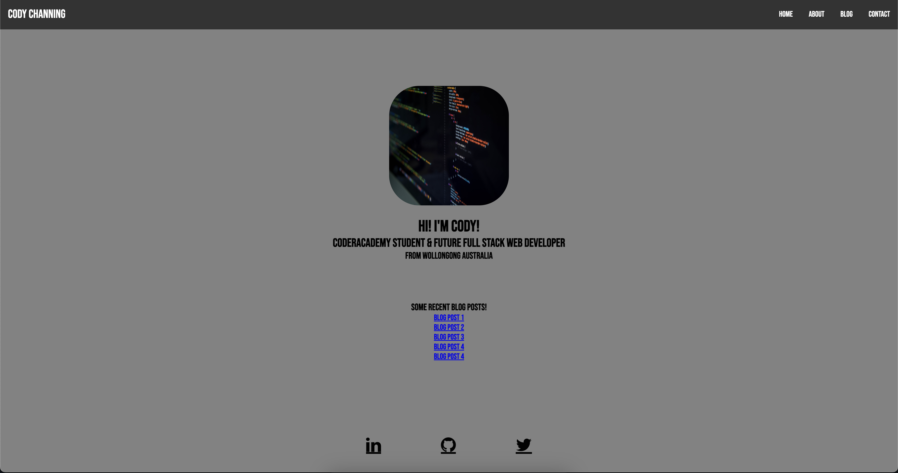
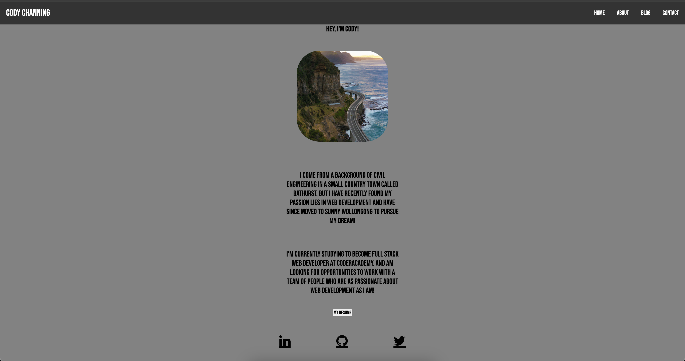
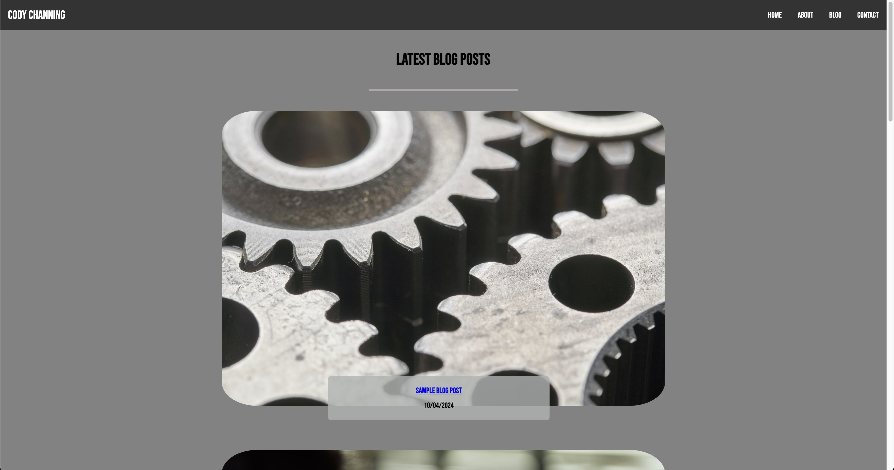
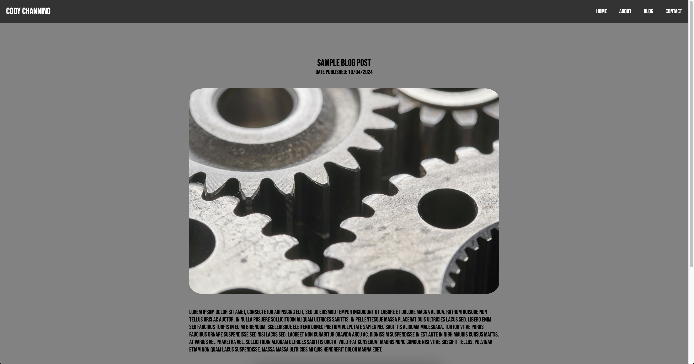
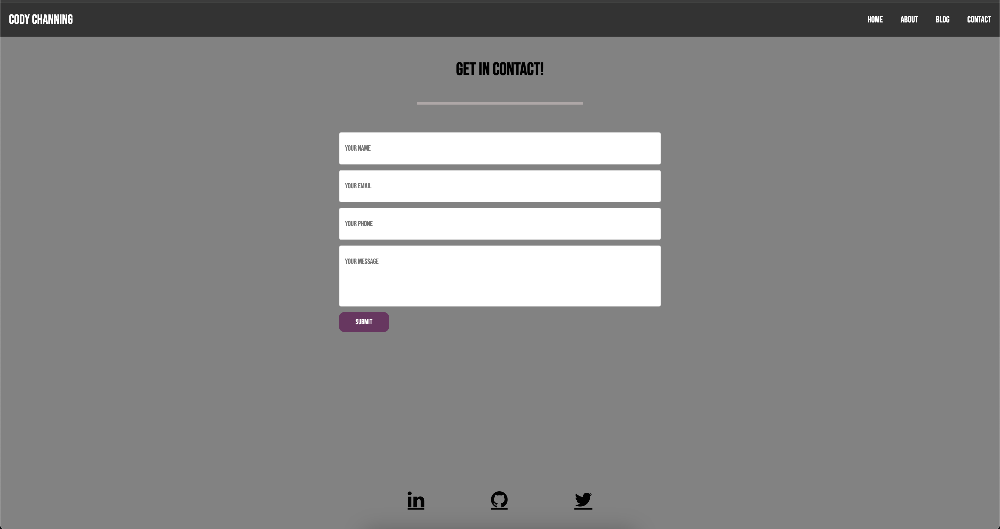
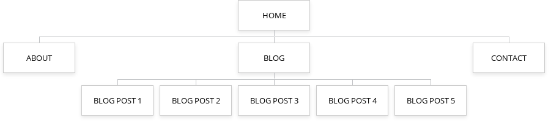
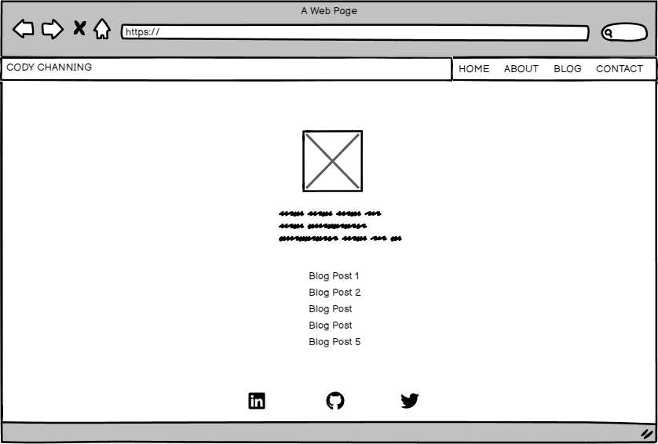
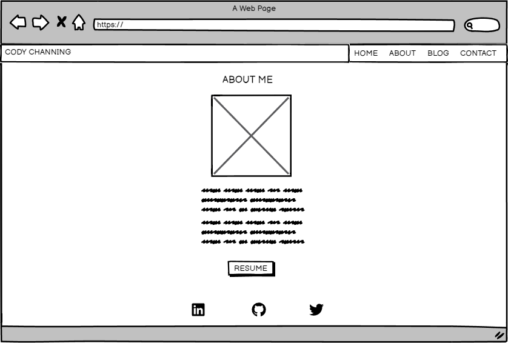
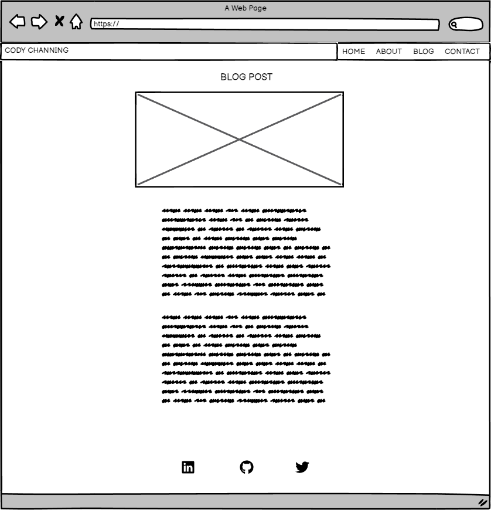
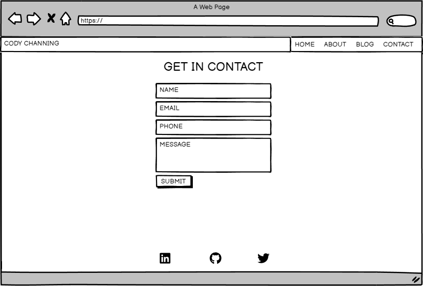

# T1A2: Portfolio

[Github Repository](https://github.com/cchanning1996/CodyChanning_T1A2)

## Description

This is my portfolio website, designed to showcase my skills and development during my WebDevelopment journey.

### Purpose

The purpose of this website is to demonstrate my skills and projects for future employers and fellow developers.

### Fuctionality & Features

#### Features All Pages Share

- All pages share the same sleek grey navbar with links to all other pages.
- The navbar buttons transform into a burger menu when the screen size is reduces.
- The footer includes linked buttons to LinkedIn, GitHub & X (formerly twitter) with sublte purple hover animation to let the user know where they can find me.
- The site features a consistent monotoned "grey" asthetic throughout which I feel gives quite a professional and sleek appearance for the user.
- The hover and transition effects enhance the user experience further and contribute to the overall aesthetics of the site.
- The inclusion of current social media icons and links also adds to the overall user experience allowing them to connect with me easily and effectively.

#### Home Page

- The home page showcases a hero image to draw the users eye.
- The home page also includes a brief introduction to the user.
- Following this, I have created a list of some recent blog posts to give the user quick access to further information.

#### About Page

- The about page features a prominent hero image.
- There is then a more in depth personal information section to connect with the user.
- I have then included a download button for my Resume for any potential employer to have easy access to.

#### Blog Posts

- The blog page includes a hero image for each blog post with a containter layered on top to link the image to the blog post itself.
- The container includes a link to the post and the date it was published.

#### Contact Page

- The contact page features the same sleek monotoned grey look.
- The contact form contrasts the background and has a slight pop of purple witht he submit button.
- The contact form allows the user to get in contact with myself for any employment or collaboration.

### Screenshots

Home page

About page

Blog Posts

Sample blog post

Contact page

### Sitemap

Home page

About page

Blog Posts

Sample blog post

Contact form

### Target Audience

The target audience of this project is my current CoderAcademy educators or any potential employer.

### Tech Stack

- HTML
- CSS
- JavaScript
- Markdown
